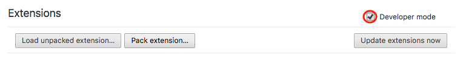

#  Lazarus: Form Recovery  Chrome Version

*Recover lost forms with a single click*

Ever had one of those "oh $*#@" moments when you realize you've just lost half an hour of your life because something went wrong while you were entering stuff into a web form and there doesn't seem to be any way to recover it? If so, you need Lazarus. If not, install it anyway, before disaster strikes!

Lazarus securely saves forms as you type, allowing you to safely recover your lost work after server timeouts, network issues, browser crashes, power failures, and all the other things that can go wrong while you're entering forms, editing content, writing webmail, etc, etc, etc...

## Status
This is the Chrome version in BETA.

Chrome version: Version 64.0.3282.186
OS: macOS Sierra v10.12.6

## Installation

1. Clone the repo on your local machine
[https://github.com/manfontan/lazarus](https://github.com/manfontan/lazarus)
2. Go to chrome://extensions/
3. Enable Developer module

--

4. Load unpacked extensions (Browse the folder containing `manifest.json` you cloned in step 1)

5. Lazarus Extension is ready.

